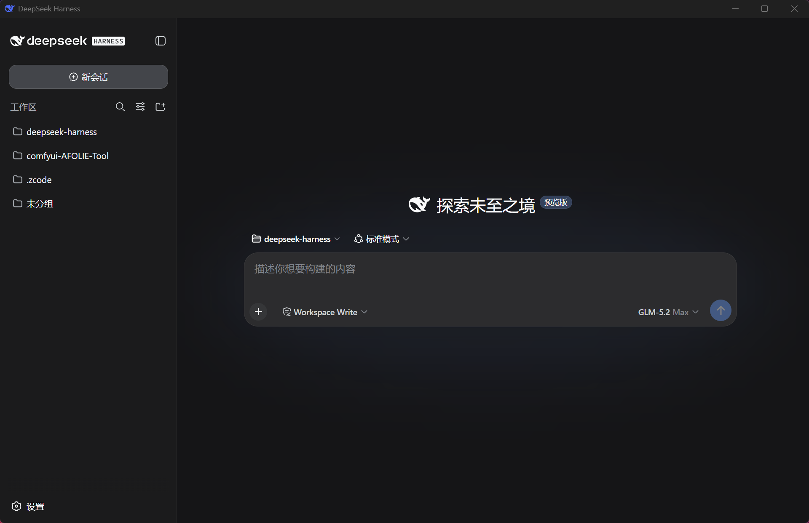

# DSH Desktop (dsh-desktop-windowos)

**[中文](#中文) | [En](#english)**

<p align="center">
  
</p>

---

## 中文

DeepSeek Harness(DSH)的 Windows 桌面壳,基于 **Tauri v2 + React 18 + TypeScript**。
打开应用 → 自动拉起本机 DSH Web 服务 → 窗口直接显示原生 webchat → 托盘常驻,任务完成弹系统通知。
交付物是**单个免安装裸 exe**(约 4.5 MB)。

**推荐用法**:在任意文件夹执行 `pnpm add @deepseek-ai/dsh`(或 `npm i @deepseek-ai/dsh`),把 exe 放进**同一文件夹的根目录**双击即可——应用自动发现旁边的 `node_modules\.bin\dsh.cmd`,启动零下载、零配置、不询问。

### 功能

- **开箱即用**:双击 exe 自动启动 DSH(`pnpm dsh web`),就绪后窗口直接打开 `http://127.0.0.1:3080/` 的**原生 webchat 界面**(不自创聊天 UI、不做反向代理)
- **托盘常驻**:关闭窗口(X)只是隐藏到托盘,DSH 后台继续运行;**双击托盘图标**或**右键 → Open DSH** 随时唤回窗口
- **一键重启 DSH**:托盘右键 → 「重启 DSH」即可完整重启 DSH 服务(杀掉 3080 进程树并重新拉起),无需退出应用再点桌面快捷方式;会话数据在 `~/.dsh` 持久化,不丢失
- **任务完成通知**:会话从运行中转为空闲时弹 Windows 系统通知,带两个按钮——**「打开窗口」**(复现并聚焦窗口)和**「明白」**(收起通知);不点击则数秒后自动收起
- **链接右键菜单**:在聊天里的链接上右键,显示简洁菜单「在浏览器中打开」/「复制链接」(替换误导性的 WebView2 默认菜单);左键点击外链仍由系统默认浏览器打开
- **附加模式**:启动时若 3080 已有 DSH 在跑,直接连接不重复拉起;退出时也**不会动**别人(先于应用存在)的实例
- **干净退出**:仅托盘右键 → 「退出(关闭 DSH)」才真正退出,自动 `taskkill /T` 杀掉自己拉起的整棵进程树,零孤儿进程
- **防重复实例**:exe 被再次双击只会唤回已有窗口,不会开第二个
- **便携小巧**:单文件、无安装器、无 DLL 依赖,数据/日志写在 `%LOCALAPPDATA%\dsh-desktop\`
- **本地优先启动,下载需确认**:按候选链自动启动 DSH——PATH 全局安装的 `dsh web` → 项目本地 `node_modules\.bin\dsh.cmd`(exe 同目录/工作目录/用户目录,覆盖 `pnpm add` 本地安装)→ 已确认过的 npx 下载;全都找不到时**弹窗让你选**下载/重新检测/退出,不会静默下载几百 MB 依赖。源码开发者可用环境变量 `DSH_CMD` / `DSH_CWD` 完全自定义启动命令

### 前提条件

目标机器需已具备(exe 不携带):

| 项 | 要求 |
|---|---|
| Node.js | ^22.19 或 ≥ 24(**必须**;DSH 的 Node 版本要求) |
| DSH | 可选,三种方式任一:全局安装 `npm i -g @deepseek-ai/dsh`(最快,推荐);本地安装(在 exe 旁或任意被搜索目录执行 `pnpm add @deepseek-ai/dsh`);都没有则首次启动时点「下载并启动」走 npx |
| 从源码跑 DSH 的开发者 | 设 `DSH_CMD`(`pnpm dsh web`)与 `DSH_CWD`(DSH 仓库路径)环境变量 |
| WebView2 | Windows 11 自带 |

### 快速开始

**方式一:装 DSH 插件(推荐给 DSH 用户)**

```sh
dsh plugin --profile web add dsh-desktop-plugin
```

重启 DSH 后插件自动把 exe 装到 `%LOCALAPPDATA%\Programs\dsh-desktop-windowos\` 并在桌面生成快捷方式「DeepSeek Harness」;对话里说“打开桌面应用”还能通过 `desktop_launch` 工具直接拉起。详见 [plugin/README.md](plugin/README.md)。

**方式二:直接下载 exe**

1. 从 [Releases](https://github.com/RAFOLIE/dsh-desktop-windowos/releases) 下载 `dsh-desktop-windowos-v<版本>.exe`,双击运行(免安装单文件,无需解压)。**首次运行 Windows SmartScreen 可能拦截(exe 未签名)**:点「更多信息 → 仍要运行」即可
2. 机器满足以下任一状态,双击后自动进入 webchat:
   - **已有 DSH 在跑**(如自己开过 `dsh web`)→ 自动附加,直接使用,无需 Node 在 PATH
   - **全局装了 DSH**(`npm i -g @deepseek-ai/dsh`,**推荐**)→ 启动最快,无需网络
   - **本地装了 DSH**(在 exe 同目录、工作目录或用户目录 `pnpm add @deepseek-ai/dsh`)→ 自动发现 `node_modules\.bin\dsh.cmd` 并使用
   - **之前选过「下载并启动」** → 自动经 `npx --yes @deepseek-ai/dsh web` 拉起(首选项记录在 `%LOCALAPPDATA%\dsh-desktop\settings.json`)
3. 若本地没有任何 DSH:启动页弹出选择——**「下载并启动」**(首次下载约几分钟,之后走缓存)/「重新检测」/「退出」,不会未经同意就开始下载;需 Node.js(^22.19 或 ≥ 24)

### 构建前提(Windows)

- Rust msvc 工具链 + VS 2022 生成工具("MSVC v143 C++ 生成工具" + Windows 11 SDK)

```powershell
pnpm install        # 本项目是独立工作区根
pnpm tauri dev      # 开发模式
pnpm tauri build    # 产物:src-tauri\target\release\dsh-desktop-windowos.exe
```

### 工作原理

- Rust 侧以 `POST /api/host.describe` 探测就绪(`result.ok === true` 即就绪);启动走本地优先候选链:`DSH_CMD` 环境变量 → `dsh web`(PATH 全局)→ `node_modules\.bin\dsh.cmd`(exe 同目录/工作目录/用户目录)→ 已确认过的 `npx --yes @deepseek-ai/dsh web`(首选项持久化在 `%LOCALAPPDATA%\dsh-desktop\settings.json`),链空则发 `notfound` 事件由启动页让用户选;每个候选独立就绪窗口,失败自动降级并在日志/错误信息中记录每次尝试;子进程经 `cmd /C` 拉起(加 `CREATE_NO_WINDOW`,stdout/stderr 写日志)
- 监听 `ws://127.0.0.1:3080/api/events.host`,在 `host/session-status` 的 `running` 出现 **true→false 边沿**且主窗口隐藏时,经 `session.list` 取会话标题弹通知
- 裸 exe 无安装器,Windows 会静默吞 Toast——应用启动时自动在注册表注册 AppUserModelID(`HKCU\Software\Classes\AppUserModelId\com.dsh.desktop`)保证通知可达

### 项目结构

```
src/                 React boot 页(等待/错误态;就绪后整窗跳转 3080)
src-tauri/src/
  dsh.rs             DSH 生命周期:探测 / spawn / 等就绪 / taskkill /T 退出清理
  monitor.rs         events.host WS 监听:running 边沿 + 两按钮通知 + 断线重连
  lib.rs             托盘、窗口 X=隐藏、single-instance、AUMID 注册
icon-src/            图标源(DeepSeek 鲸鱼标,品牌蓝 #4D6BFE)
```

---

## English

A Windows desktop shell for DeepSeek Harness (DSH), built with **Tauri v2 + React 18 + TypeScript**.
Launch the app → it auto-starts the local DSH web service → the window shows the native webchat → tray-resident with system notifications on task completion.
Ships as a **single portable bare exe** (~4.5 MB, no installer).

**Recommended setup**: run `pnpm add @deepseek-ai/dsh` (or `npm i @deepseek-ai/dsh`) in any folder, then drop the exe into **that folder's root** and double-click — the app auto-discovers the adjacent `node_modules\.bin\dsh.cmd`: zero download, zero config, no questions asked.

### Features

- **Zero-setup**: double-click the exe and it starts DSH (`pnpm dsh web`); once ready, the window opens the **native webchat** at `http://127.0.0.1:3080/` (no custom chat UI, no reverse proxy)
- **Tray-resident**: closing the window (X) only hides it to the tray while DSH keeps running; **double-click the tray icon** or **right-click → Open DSH** brings the window back
- **One-click DSH restart**: tray right-click → "重启 DSH" fully restarts the DSH service (kills the process tree on 3080 and starts it again) — no need to quit and re-launch from the desktop shortcut; sessions persist in `~/.dsh`
- **Task-done notification**: when a session transitions from running to idle, a Windows toast fires with two buttons — **"Open Window"** (restore & focus) and **"Got it"** (dismiss); left untouched it auto-collapses after a few seconds
- **Link context menu**: right-clicking a link in the chat shows a clean two-item menu — "Open in browser" / "Copy link" (replacing the misleading default WebView2 menu); left-click still opens external links in the system default browser
- **Attach mode**: if DSH is already listening on 3080 at startup, the app attaches instead of spawning a second one — and never kills an instance it didn't start
- **Clean exit**: only tray right-click → "Quit (close DSH)" exits, tearing down the process tree it spawned via `taskkill /T` with zero orphans
- **Single instance**: launching the exe again just focuses the existing window
- **Portable & small**: one file, no installer, no DLL dependencies; data/logs go to `%LOCALAPPDATA%\dsh-desktop\`
- **Local-first launch, download with consent**: starts DSH via a candidate chain — PATH-global `dsh web` → project-local `node_modules\.bin\dsh.cmd` (exe dir / working dir / user profile, covering `pnpm add` local installs) → a previously consented npx download; when nothing local exists the boot page **asks** download / re-detect / exit instead of silently pulling hundreds of MB. Source developers can fully customize via the `DSH_CMD` / `DSH_CWD` env vars

### Prerequisites (target machine)

Not bundled with the exe:

| Item | Requirement |
|---|---|
| Node.js | ^22.19 or ≥ 24 (**required**; the Node version DSH declares) |
| DSH | optional, any of: global install `npm i -g @deepseek-ai/dsh` (fastest, recommended); local install (`pnpm add @deepseek-ai/dsh` beside the exe or in any searched dir); or click "下载并启动" on first launch to go through npx |
| Running DSH from source | set the `DSH_CMD` (`pnpm dsh web`) and `DSH_CWD` (DSH repo path) env vars |
| WebView2 | included with Windows 11 |

### Quick Start

**Option A: install the DSH plugin (recommended for DSH users)**

```sh
dsh plugin --profile web add dsh-desktop-plugin
```

After restarting DSH, the plugin auto-installs the exe into `%LOCALAPPDATA%\Programs\dsh-desktop-windowos` and creates the desktop shortcut "DeepSeek Harness"; saying "open the desktop app" in chat launches it via the `desktop_launch` tool. See [plugin/README.md](plugin/README.md).

**Option B: download the exe directly**

1. Download `dsh-desktop-windowos-v<version>.exe` from [Releases](https://github.com/RAFOLIE/dsh-desktop-windowos/releases) and double-click it (single portable file, no unzip needed). **Windows SmartScreen may warn on first run (the exe is unsigned)**: click "More info → Run anyway"
2. Any of these machine states works — the app auto-enters the webchat after launch:
   - **DSH already running** (e.g. you started `dsh web` yourself) → auto-attach, works immediately, no Node needed on PATH
   - **DSH installed globally** (`npm i -g @deepseek-ai/dsh`, **recommended**) → fastest launch, no network needed
   - **DSH installed locally** (`pnpm add @deepseek-ai/dsh` beside the exe, in the working dir, or the user profile) → `node_modules\.bin\dsh.cmd` is discovered and used
   - **"Download" picked before** → DSH auto-starts via `npx --yes @deepseek-ai/dsh web` (choice persisted in `%LOCALAPPDATA%\dsh-desktop\settings.json`)
3. With no local DSH at all: the boot page offers a choice — **"下载并启动" (download & start, first run takes a few minutes)** / "重新检测" (re-detect) / "退出" (exit). Nothing downloads without consent; Node.js ^22.19 or ≥ 24 is required for the npx path

### Building (Windows)

- Rust msvc toolchain + VS 2022 Build Tools ("MSVC v143 C++ build tools" + Windows 11 SDK)

```powershell
pnpm install        # this project is its own workspace root
pnpm tauri dev      # dev mode
pnpm tauri build    # output: src-tauri\target\release\dsh-desktop-windowos.exe
```

### How it works

- The Rust side probes readiness via `POST /api/host.describe` (`result.ok === true`); launch runs a local-first candidate chain: `DSH_CMD` env var → `dsh web` (global install on PATH) → `node_modules\.bin\dsh.cmd` (exe dir / working dir / user profile) → a previously consented `npx --yes @deepseek-ai/dsh web` (choice persisted in `%LOCALAPPDATA%\dsh-desktop\settings.json`); an empty chain emits `notfound` and the boot page offers download / re-detect / exit — each candidate has its own readiness window, falls through on failure with every attempt logged; the child is spawned via `cmd /C` (with `CREATE_NO_WINDOW`; stdout/stderr to a log file)
- It listens on `ws://127.0.0.1:3080/api/events.host`; on a **true→false edge** of `running` in `host/session-status` while the window is hidden, it resolves the session title via `session.list` and fires the toast
- A bare exe has no installer, so Windows would silently drop toasts — the app registers its AppUserModelID in the registry at startup (`HKCU\Software\Classes\AppUserModelId\com.dsh.desktop`) to make notifications work
